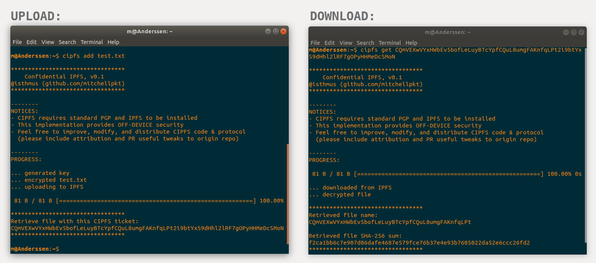

# Confidential InterPlanetary File System
Confidentiality layer for IPFS decentralized storage

CIPFS is an encryption layer on top of the existing IPFS. A random key is generated for each upload and appended to the name used to address files. For the sender and receiver, the UX is the same, except that the file reference is 79 characters long instead of 46 characters. However the nodes and surveilling entities can no longer access any of the files they are holding.

# Use
CIPFS syntax mimics IPFS - just add a 'c' on front.



## Upload a file
Run: `cipfs add <plaintext filename>`

(displays the CIPFS ID at the end)
## Download a file
Run: `cipfs get <CIPFS ID>`

(writes file to current directory)
## Example
### Upload

Run: `$ ./cipfs.sh add CIPFS_logo.png`

Output:
```
*********************************
    Confidential IPFS, v0.1
@isthmus (github.com/mitchellpkt)
*********************************

... generated key
... encrypted test.txt
... uploading to IPFS

 19.92 KiB / 19.92 KiB [===============================================] 100.00%

*********************************
Retrieve file with this CIPFS ticket:
CQmZw7LBEQn2HkKXR4NjwMsZSF7c6ThRTLyKSjEzWpsjY77k0OnHY9fOEzVw15bERThqoKu6zJxgolc
*********************************
```

### Download
Run: `$ ./cipfs.sh get CQmZw7LBEQn2HkKXR4NjwMsZSF7c6ThRTLyKSjEzWpsjY77k0OnHY9fOEzVw15bERThqoKu6zJxgolc  `
Output:
```
PROGRESS:

 19.92 KiB / 19.92 KiB [============================================] 100.00% 0s

... downloaded from IPFS
... decrypted file

*********************************
Retrieved file name:
CQmZw7LBEQn2HkKXR4NjwMsZSF7c6ThRTLyKSjEzWpsjY77

Retrieved file SHA-256 sum:
79228e7f85692032b5c49285c95bc4af7e487e526d982a1dc66ddd8cb188e1a0
*********************************
```
## Motivation
The current implementation of IPFS offers no privacy by default - files are uploaded in plaintext, and accessible to strangers' nodes and anybody with the hash.

## Notation
Let `||` represent string concatenation, and `H(...)` represent IPFS's hash function

## Current System (no privacy)
We have a (plaintext) message or file `P` that we would like to store on IPFS. IPFS uses a global namespace with hash-based content-addressing, so we upload `P` and access it later by querying `H(P)`. 

There are several downsides
-  IPFS nodes can read `P`.
-  Anybody with `H(P)` can retrieve `P`.
-  Anybody with a file `P` can calculate `H(P)` and test whether the file was uploaded to IPFS previously.

^^ Note that these are largely features & design decisions rather than bugs. There are always privacy / convenience / scaling tradeoffs, and CIPFS will provide privacy (i.e. solve the 3 issues listed above) at the expense of a longer ID string and file deduplication.

## Confidential IPFS

### Upload Procedure 

Suppose Arlene wishes to share plaintext document `P` with Boris using IPFS. The CIPFS client performs this procedure:
1.  Generate random number `R` from a pseudorandom number generator.
2.  Symmetric encrypt `P` with `R` to generate ciphertext `X`.
3.  Upload `X` to IPFS (which will index it by `H(X)`).
4.  Display `CIPFS_ticket`, which is `C || H(X) || R`.

### Download Procedure 

Now, Arlene gives the `CIPFS_ticket` string containing the pointer and the key to Boris. Boris's CIPFS client performs this procedure:
1.  Break `CIPFS_ticket` into `H(X)` and `R`.
2.  Query IPFS for `H(X)` and download `X`.
3.  Symmetric decrypt `X` using `R` to produce `P`.
4.  Display/save `P`.

### Notes
A few nice characteristics emerge
-  **No read access for infrastructure**: Only Arlene and Boris have `R` so the IPFS nodes cannot decrypt `X` to read `P`.
-  An attacker with `P` **cannot perform hypothesis** testing about file existance on IPFS, since without `R` they cannot generate X` or `H(X)`.
-  Similarly, **censorship and surveillance resistance** arise since `R` introduces ciphertext unlinkability. Even if I am an attacker with `P` and total surveillance over IPFS, I cannot prove which encrypted files & transmissions are related.
-  Arlene can share a **linked commit** by posting `H(X)` to prove that that `X` exists on IPFS. She can later reveal `R` to unlock `P`.
-  Arlene can also share an **unlinked commit** by posting `H(C||H(X)||R)`, which is also `H(CIPFS_ticket)`. Others cannot verify whether or not `X` exists on IPFS until Arlene reveals `CIPFS_ticket`.
